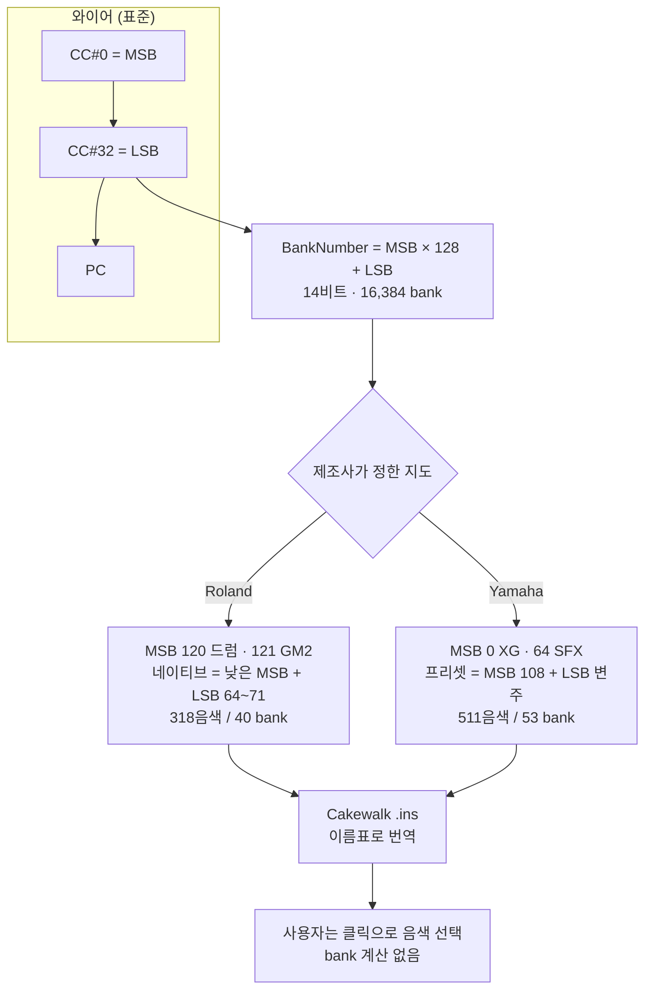

# MIDI Instrument Definition Generator: 같은 3바이트, 두 벤더의 서로 다른 분할

> 디렉터(Mike)가 2019년에 시작해 2025년에 Yamaha 기종으로 확장한 개인 도구를,
> Aether Turing Dynamics(ATD)가 편입하여 전수 분석·감사·문서화한 기술 케이스 스터디입니다.

---

## 1. 프로젝트 목적 및 배경 (Goal & Mission)

### 해결 과제: "Concert Piano" 라고 입력할 방법이 없다

Roland HP603이 집에 들어온 뒤, DAW에서 그 피아노의 음색을 고르는 일은 수작업이었습니다. 제조사 사용자 매뉴얼에는 MIDI 정보가 거의 없고, 인터넷에는 이 기종의 악기 정의 파일이 없었습니다. 결국 DAW의 악기 목록에 `Piano` 같은 이름 대신 bank 번호를 직접 입력해야 합니다.

문제는 그 번호를 계산하는 일입니다. Roland 계열 기기의 bank 번호는 두 개의 컨트롤러 값으로 만들어집니다. 사용자는 음색 목록 PDF를 보며 `CC#0`과 `CC#32`를 눈으로 찾아 곱하고 더한 뒤 그 숫자를 입력합니다. 곡마다 음색을 바꿀 때마다 이 계산을 반복합니다.

이 프로젝트는 그 계산을 없앱니다. 그리고 그 과정에서 **같은 MIDI 표준을 쓰는 두 제조사가 악기 주소 공간을 서로 호환되지 않게 나눠 쓰고 있다**는 사실이 드러납니다.

### 이 프로젝트가 실증하는 것

코드는 498행입니다. 그 자체로는 얇은 변환 계층에 불과합니다. 이 프로젝트의 값어치는 코드가 아니라 **얻어내기 어려운 도메인 지식**에 있습니다.

- MIDI bank select가 와이어에서 어떤 3바이트로 흐르는가
- 그 14비트 주소 공간을 Roland와 Yamaha가 각각 어떻게 분할했는가
- 그 분할이 **왜** 그렇게 생겼는가 (표준에 내준 영역과 사적 영역의 구분)
- 문서에 없는 부분을 실기 응답으로 어떻게 확정하는가

같은 498행을 코드 실력만으로는 쓸 수 없습니다. PDF 데이터 리스트를 800행 넘게 전사하고, 실기에 바이트를 쏴서 확인하고, 벤더별 규칙을 귀납해야 그 498행이 나옵니다. 이 케이스 스터디는 **도메인 지식이 결과물의 상한을 결정한다**는 명제의 실증입니다.

---

## 2. MIDI Bank Select 프로토콜 (공통 규칙)

### 2-1. 악기 선택은 3바이트다

MIDI에서 음색을 고르는 표준 절차는 세 개의 메시지를 순서대로 보내는 것입니다.

```
CC#0  Bank Select MSB   (Control Change, controller 0)
CC#32 Bank Select LSB   (Control Change, controller 32)
PC    Program Change
```

`CC#0`과 `CC#32`는 각각 0~127 값을 가집니다. 이 둘을 합쳐 bank 번호를 만듭니다.

```
BankNumber = CC#0 * 128 + CC#32
```

`CC#0`이 상위 7비트, `CC#32`가 하위 7비트가 되어 14비트 주소, 즉 16,384개의 bank가 만들어집니다. 각 bank 안에 Program Change의 128칸이 있으므로, 이론상 **2,097,152개의 음색 주소**가 존재합니다.

문제는 이 방대한 주소 공간을 어떻게 나눠 쓸지가 표준에 없다는 점입니다. MIDI 협회는 "은행 번호는 컨트롤러 0에 128을 곱하고 컨트롤러 32를 더한 값"이라고만 정의합니다. **어느 bank에 무엇이 들어 있는지는 각 제조사가 정합니다.** 이것이 벤더 호환성 문제의 근원입니다.

### 2-2. 표준이 점유한 영역

벤더들이 공통으로 비워 둔 구역이 있습니다. 이 구역을 알면 어느 기기에서든 같은 방식으로 GM 음색에 접근할 수 있습니다.

| bank (MSB=CC#0) | 용도 | 근거 표준 |
| :--- | :--- | :--- |
| `120` | 드럼 kit | GS / GM |
| `121` | GM2 확장 음색 (LSB가 변주) | GM System Level 2 |

그리고 기기가 GM2 모드로 동작하려면 시작 시 별도의 신호를 받아야 합니다. `find_roland_gm_inst.py`가 보내는 바이트가 그것입니다.

```python
sysex=[0xf0, 0x7e, 0x7f, 0x09, 0x03, 0xf7]   # Universal SysEx: GM2 On
```

`F0`는 SysEx 시작, `7E`는 Universal Non-Real Time, `7F`는 대상 기기 전체, `09`는 GM System On, `03`은 GM2, `F7`은 SysEx 종료입니다. 이 한 줄을 보내야 기기의 `MSB=121` bank가 GM2 음색으로 채워집니다.

**표준이 점유한 구역은 이 두 bank뿐입니다.** 나머지 16,382개 bank는 제조사 자유 영역이고, 여기서 벤더들이 갈라집니다.

---

## 3. 벤더별 구현 대조 (핵심 분석)

두 기종의 실제 데이터를 전수 집계한 결과입니다.

| | Roland HP603 | Yamaha CLP-685 |
| :--- | :--- | :--- |
| 총 규모 | 318음색 / 40 bank | 511음색 / 53 bank |
| 네이티브 영역 | MSB `0·1·2·4·8·16·24·32·47` + LSB `64~71` (bank 0 예외) | MSB `108` + LSB `0~7, 100` |
| 네이티브 규모 | 53음색 / 29 bank | 31음색 / 9 bank |
| 표준 확장 | **MSB 121** = GM2 (LSB 0~9) → 256음색 | **MSB 0** = XG (LSB 43종) → 438음색 |
| 드럼·효과 | MSB 120 → 9 kit | MSB 64 → XG SFX 42음색 |
| 데이터 출처 | Roland LX-7 MIDI 구현 PDF p.12-14 | CLP-685/695GP Data List (Yamaha) |

### 3-1. Roland: 표준에 두 개의 bank를 내주고 낮은 MSB에 네이티브를 깐다

Roland HP603의 네이티브 음색은 **낮은 MSB 값과 LSB 64~71 조합**에 흩어져 있습니다.

```
CC#0=  0 (  0*128) bank  9개 LSB=[0, 64, 65, 66, 67, 68, 69, 70, 71] 악기  25건
CC#0=  1 (  1*128) bank  3개 LSB=[65, 66, 67]                        악기   7건
CC#0=  2 (  2*128) bank  3개 LSB=[64, 65, 66]                        악기   3건
CC#0=  4 (  4*128) bank  1개 LSB=[64]                                악기   1건
CC#0=  8 (  8*128) bank  6개 LSB=[64, 66, 67, 68, 69, 70]            악기   7건
CC#0= 16 ( 16*128) bank  3개 LSB=[64, 66, 67]                        악기   6건
CC#0= 24 ( 24*128) bank  1개 LSB=[65]                                악기   1건
CC#0= 32 ( 32*128) bank  2개 LSB=[68, 69]                            악기   2건
CC#0= 47 ( 47*128) bank  1개 LSB=[65]                                악기   1건
--- 이상 네이티브 ---
CC#0=120 (120*128) bank  1개 LSB=[0]                                 악기   9건
CC#0=121 (121*128) bank 10개 LSB=[0..9]                              악기 256건
```

40개 bank의 구성을 분해하면 `MSB=121` GM2 10개, `MSB=120` Drums 1개, 나머지 29개입니다. 이 29개 중 **28개가 LSB 64~71**에 모여 있고, 예외가 하나 있습니다.

**첫째, LSB 64 이상은 Roland가 사적으로 쓰는 구역입니다.** 29개 중 28개(50음색)가 LSB 64~71에 있습니다. MSB가 `0·1·2·4·8·16·24·32·47`로 흩어져 있어도 LSB는 64~71 범위를 벗어나지 않습니다. LSB 0~63은 표준 확장에 내준 구역으로 보이며, 실제로 GM2 음색은 `MSB=121`에 LSB 0~9로 들어가 있습니다.

**예외는 bank 0(`MSB 0 × 128 + LSB 0`) 하나입니다.** 여기에만 LSB 0인 네이티브 음색 3건이 있습니다.

```
bank 0 (MSB 0, LSB 0): prog 40 Violin · prog 42 Cello · prog 45 Pizzicato Str
```

이 셋의 프로그램 번호 40·42·45는 GM 표준에서 바이올린·첼로·피치카토 스트링에 배정된 번호와 정확히 일치합니다. 즉 bank 0은 Roland 사적 영역이 아니라 **GM 표준 bank**이고, 여기 들어간 3건은 GM 음색입니다. 원본 데이터에서 이 셋이 `Strings` 그룹에 섞여 있어 앞선 집계에서 네이티브로 분류되었습니다.

**둘째, bank 이름이 음색 계열을 나타냅니다.** MSB가 `0`이면 `Piano A`, `16`이면 `Piano B`, `4`이면 `Piano C` 식으로, 흩어진 주소를 사람이 읽는 이름으로 묶었습니다. 이 이름은 문서에 없습니다. 저자가 실기에서 하나씩 눌러보며 붙였고, 코드 주석이 그 사실을 숨기지 않습니다.

```python
# bank texts are subjectively named, not read from the MIDI implementation.
```

### 3-2. Yamaha: MSB 108을 프리셋 전용으로 쓰고 MSB 0을 XG에 내준다

Yamaha CLP-685는 전혀 다른 분할을 씁니다. 데이터 리스트가 음색을 두 카테고리로 나누고 있습니다.

```
[Preset Voices]  악기  31건 / bank  9개
   CC#0=108  CC#32=[0, 1, 2, 3, 4, 5, 6, 7, 100]

[XG Voices]      악기 480건 / bank 44개
   CC#0=  0  CC#32=[0, 1, 3, 6, 8, ... 101]  악기 438건
   CC#0= 64  CC#32=[0]                        악기  42건
```

**MSB 108은 Yamaha가 프리셋 음색에 배정한 사적 bank입니다.** Roland가 MSB 120·121을 표준에 내준 것과 대조적으로, Yamaha는 MSB 108이라는 낮지도 높지도 않은 값을 골라 자기 프리셋을 몰아넣었습니다. 이 값은 GM/GS/XG 어느 표준에도 정의되어 있지 않습니다.

프리셋 9개 bank의 내부 구조는 정연합니다.

```
bank 13824 (CC#32=  0) prog   1  [Piano]   CFX Grand
bank 13824 (CC#32=  0) prog   2  [Piano]   Bright Grand
bank 13824 (CC#32=  0) prog   3  [Piano]   Rock Grand
bank 13824 (CC#32=  0) prog   5  [E.Piano] Stage E.Piano
bank 13824 (CC#32=  0) prog  20  [Organ]   Organ Tutti
bank 13824 (CC#32=  0) prog  49  [Strings] Strings
bank 13825 (CC#32=  1) prog   1  [Piano]   Mellow Grand
bank 13826 (CC#32=  2) prog   1  [Piano]   Ballad Grand
bank 13830 (CC#32=  6) prog   1  [Piano]   Bösendorfer
bank 13924 (CC#32=100) prog   1  [Piano]   Binaural CFX Grand
```

Program Change가 **GM 프로그램 번호 체계를 따릅니다.** prog 1~3은 그랜드 피아노, 5는 일렉트릭 피아노, 20은 오르간, 49~50은 스트링입니다. GM 표준의 프로그램 번호 배치와 일치합니다. 즉 Yamaha는 **LSB로 변주를 고르고 PC로 음색 계열을 고르는 2축 구조**입니다. `CC#32=0`의 `prog 1`이 CFX Grand, `CC#32=100`의 `prog 1`이 Binaural CFX Grand, `CC#32=6`의 `prog 1`이 Bösendorfer — 같은 PC를 유지한 채 LSB만 바꾸면 같은 계열의 다른 피아노가 나옵니다.

그리고 XG는 `MSB=0`에 438음색을 몰아넣고, XG의 효과음은 `MSB=64`에 42건을 따로 둡니다. `MSB=64`에는 `CuttingNoise`, `StringSlap`, `FluteKeyClick`, `Shower`, `Thunder` 같은 음색이 있습니다.

### 3-3. 결론: 두 주소 체계는 호환되지 않는다

정리하면 이렇습니다.

| | Roland | Yamaha |
| :--- | :--- | :--- |
| 공용·표준 영역 | `120` 드럼 · `121` GM2 (GS/GM 표준) | `0` XG · `64` SFX (Yamaha 사적 규격) |
| 프리셋 MSB | 낮은 값 여럿 (0~47) | `108` 단일 |
| LSB의 의미 | 음색 계열 (64~71이 사적 영역) | 변주 깊이 (0~7, 100) |
| PC의 의미 | bank 내 목록 순번 | GM 프로그램 계열 |

Roland에서 `Concert Piano`는 bank 68(`MSB 0 × 128 + LSB 68`), prog 0입니다. Yamaha에서 `CFX Grand`는 bank 13824(`MSB 108 × 128 + LSB 0`), prog 1입니다. **bank 번호를 넘겨줄 공통 표기가 존재하지 않습니다.** 같은 3바이트를 쓰지만 두 기기의 주소 지도는 겹치지 않습니다.

이것이 이 프로젝트가 존재하는 이유입니다. 벤더 중립적인 "피아노 음색" 같은 것은 없고, 기기마다 다른 지도를 사람이 읽을 수 있는 이름표로 바꿔야 합니다.



---

## 4. 역분석 방법론

이 지도는 어디에도 공개되어 있지 않았습니다. 저자가 세 경로를 조합해 확정했습니다.

### 4-1. PDF 데이터 리스트 전사

두 기종 모두 제조사가 배포한 데이터 리스트 PDF가 유일한 1차 자료였습니다. Roland는 LX-7 MIDI 구현 문서 12~14쪽, Yamaha는 CLP-685/695GP Data List입니다. 이 PDF를 텍스트로 복사해 붙여넣고 800행 넘게 정리했습니다. Roland 318행, Yamaha 511행입니다.

전사 형식은 `이름 MSB LSB PC`입니다. 이름에 공백이 있어 앞에서 자르면 경계를 알 수 없으므로, **뒤에서 3개 토큰을 숫자로 읽는** 규칙을 씁니다.

```python
cval=list(map(int, tokens[-3:]))
tokens[-3:]=[]
inst[group].append([int(tokens[0]), ' '.join(tokens[1:])]+cval)
```

이 규칙 하나로 `Nason flt 8'`처럼 공백과 특수문자가 섞인 이름도 파싱됩니다.

### 4-2. 실기 응답 확인

PDF에 적힌 값이 기기에서 실제로 그 음색을 내는지는 문서로 알 수 없습니다. 두 개의 대화형 도구로 확인했습니다.

`test_program_change.py`는 `python-rtmidi`로 포트를 열고 세 바이트를 그대로 보냅니다.

```python
pc_msb=[ 0xb0, 0, msb ]
pc_lsb=[ 0xb0, 32, lsb ]
pc=[ 0xc0, inst ]
midiout.send_message(pc_msb)
midiout.send_message(pc_lsb)
midiout.send_message(pc)
```

`0xb0`은 Control Change 채널 메시지, `0xc0`은 Program Change입니다. 세 메시지를 연속으로 보낸 뒤 음을 울려 음색이 바뀌는지 귀로 확인합니다.

`find_roland_gm_inst.py`는 같은 일을 `mido`로 시도하며, 앞서 본 GM2 On 시스엑스를 먼저 보냅니다. GM2 모드가 켜져야 `MSB=121` bank가 채워지기 때문입니다.

다만 이쪽은 감사에서 결함이 확인되었습니다. 컨트롤 번호와 값을 혼동해 `CC#0`·`CC#32` 대신 엉뚱한 컨트롤러를 값 0으로 보냅니다.

```python
pcmsg.append(Message('control_change', control=int(val.pop())))   # value 미지정 -> 0
```

`0 68 0`을 입력하면 `control=0 value=0`, `control=68 value=0`, `program=0`이 전송됩니다. MSB와 PC가 0일 때만 우연히 맞고, `EP Belle 8 68 5`처럼 값을 넣으면 전혀 다른 음색이 나옵니다. 대화형 도구라 자동 검증이 없어 6년간 드러나지 않았습니다. 실기 검증은 바이트를 직접 구성하는 `test_program_change.py` 쪽으로 수행되었습니다.

### 4-3. bank 이름 귀납

전사가 끝나도 bank 번호는 숫자 덩어리입니다. 사람이 쓸 수 있게 하려면 이름이 필요합니다. 저자는 실기에서 bank를 바꿔가며 어떤 음색이 나오는지 확인하고, 성격이 비슷한 것끼리 묶어 `Piano A`, `Organ B`, `Orchestra C` 같은 이름을 붙였습니다.

이 작업은 자동화할 수 없습니다. PDF에 없는 정보이고, 기기에서 소리를 들어보는 것 외에 확인할 방법이 없습니다. **이 프로젝트에서 코드가 아닌 도메인 지식이 가장 많이 들어간 지점입니다.**

---

## 5. Cakewalk `.ins` — 지식을 클릭으로 환원

확정된 지도는 `.ins` 파일로 방출됩니다. 두 구역으로 나뉩니다.

```
.Patch Names

[Piano A]
0=Concert Piano
4=Stage Phaser
46=Harp

.Instrument Definitions

[Roland HP603]
Patch[68]=Piano A
```

`.Patch Names`는 bank별 음색 목록이고, `.Instrument Definitions`는 bank 번호를 bank 이름에 연결합니다. `Patch[68]`의 68이 바로 `MSB × 128 + LSB` 계산 결과입니다.

즉 `.ins`는 **사용자가 암산하던 bank 번호를 미리 펼쳐 놓은 표**입니다. 프로토콜을 이해해야만 만들 수 있지만, 쓰는 사람은 그 존재를 알 필요가 없습니다. 악기 목록에서 `Concert Piano`를 클릭하면 끝입니다.

Yamaha 쪽 생성기는 TOML 데이터를 읽어 카테고리별로 파일을 만듭니다. 실측 출력은 689행, bank 섹션 53개, 패치 엔트리 511건입니다.

---

## 6. 프로젝트 구조와 규모

### 6-1. 2단계에 걸친 개발

| 시기 | 내용 |
| :--- | :--- |
| 2019.10 | Roland HP603 지원. 데이터 전사, bank 이름 부여, 실기 검증 도구 제작 |
| 2025.12 | Yamaha CLP-685 확장. TOML 데이터 계층 도입, Streamlit 검색 앱, Yamaha 생성기 |

Roland 단계의 시점은 `.ins` 헤더의 `Mike Choi, Oct 2019` 표기와 로컬 파일 타임스탬프(2019-10-24 ~ 10-25)에 근거합니다. 두 근거 모두 저장소 이력은 아니며, 저장소의 최초 커밋은 2022-08-29입니다. Yamaha 확장은 커밋 이력(`2025-12-23`, `2025-12-26`)으로 확인됩니다.

Roland 단계는 이틀 집중 작업이었습니다. 무게중심은 코드가 아니라 318행 전사와 40개 bank 이름 부여였습니다. Yamaha 확장은 6년 뒤에 이루어졌고, 이때 데이터 형식을 TOML로 옮기고 검색 앱을 붙였습니다.

### 6-2. 저장소 구성

| 파일 | 행수 | 역할 |
| :--- | :--- | :--- |
| `generate_cakewalk_ins.py` | 114 | Roland `.ins` 생성 |
| `generate_cakewalk_yamaha_ins.py` | 107 | Yamaha `.ins` 생성 |
| `find_instruments.py` | 76 | Streamlit 악기 검색 앱 |
| `find_roland_gm_inst.py` | 89 | mido 기반 bank/patch 탐색 |
| `test_program_change.py` | 63 | python-rtmidi 기반 실기 검증 |
| `make_toml.py` | 49 | 데이터 txt → TOML 변환 |
| 계 | **498** | |

데이터 자산은 Roland 318건(`hp603 instruments.txt` 326행 중 그룹 헤더 8행 제외)과 Yamaha 511건(`data/yamaha-clp685-data.txt` 573행 중 주석·헤더 62행 제외)입니다. 산출물은 `Roland HP603.ins` 450행(40 bank)과 `Yamaha CLP-685.ins` 689행(53 bank)이며, 두 파일 모두 원본 데이터에서 재생성한 결과와 바이트 단위로 일치함을 확인했습니다.

---

## 7. ATD 편입 경과와 감사 결과

### 7-1. 편입 경과 (2026.09.20 ~ 09.21)

이 프로젝트는 ATD 편성 하에 개발된 것이 아니므로 ATD는 프로토콜 분석과 구현에 참여하지 않았습니다. 편입 시점의 코드베이스와 산출물을 분석·감사하여 문서화했습니다.

편입 첫 단계에서 **로컬 체크아웃이 2022년 스냅샷이고 원격이 2025년 12월까지 진행된 상태**임을 발견했습니다. 로컬이 3커밋 뒤처져 있었고, 분석 기준선을 원격으로 전환한 뒤 전수 재분석했습니다.

| 단계 | 담당 | 수행 내용 |
| :--- | :--- | :--- |
| 기준선 정정·전수 분석 | Atlas | 원격/로컬 불일치 발견, 프로토콜 구조 전수 집계 |
| 데이터 흐름 명세 | Leo | 전사 → bank 산출 → `.ins` 방출 흐름 정리 |
| 결함 해소 | Kai | bank 이름 중복 키 제거, 출력 줄바꿈 고정, 벤더 오표기 정정 |
| 에셋 제작 | Sora | 벤더 대조를 도판화한 16:9 대표 썸네일 |
| 감사 | Elena | 서술-구현 불일치 적발, 시크릿/PII 및 재배포 감사 |
| 검증 | Noah | 격리 환경에서 파이프라인 실행, 산출물 전수 대조 |

### 7-2. 코드 결함 (부차적)

프로젝트의 값어치는 프로토콜 지식에 있으므로 코드 결함은 결과물 정합성에 영향을 주는 것만 기술합니다.

**bank 이름 사전의 중복 키.** `generate_cakewalk_ins.py`의 이름 사전에 같은 번호가 두 번 들어간 자리가 3곳 있었습니다.

```python
15492:'GM E',
15492:'Effect A',      # 앞의 'GM E' 를 덮어씀
```

Python 딕셔너리 리터럴은 중복 키를 오류로 처리하지 않고 뒤 값을 남깁니다. 그 결과 배포된 `.ins`에서 GM 계열이 `GM A~D`에서 끊기고, 15492~15497이 `Effect A, B, D, E, F, G`로 C가 빠진 이름이 나왔습니다. 사전 리터럴을 쌍 목록으로 바꿔 중복이 검출되게 하고, GM A~E / Effect A~E로 정리했습니다.

**줄바꿈이 저장소에서 사라지는 문제.** 감사에서 이 항목의 원인이 처음 생각과 다르다는 사실이 드러났습니다.

저장소에 커밋된 `.ins`는 **LF**입니다. 작업 트리에는 CRLF가 있었지만 그것은 커밋된 적 없는 로컬 사본이었습니다. `.gitattributes`가 없고 `core.autocrlf=input`이라, Windows에서 만든 CRLF가 커밋 시 LF로 정규화됩니다.

```
$ git show HEAD:"Roland HP603.ins" | ...   # CRLF 0 / LF 450
$ python3 -c "open('Roland HP603.ins','rb')" # CRLF 450 / LF 0
$ git add "Roland HP603.ins"
warning: in the working copy of 'Roland HP603.ins', CRLF will be replaced by LF
```

즉 생성기에 줄바꿈을 고정해도 커밋을 거치면 사라집니다. Cakewalk가 Windows 애플리케이션이므로 근본 원인은 체크아웃 규칙을 선언하는 것입니다.

```
*.ins text eol=crlf
```

생성기 쪽에도 플랫폼 무관하게 CRLF를 내도록 고정했습니다. 둘을 함께 두어야 작업 트리와 저장소 양쪽이 일관됩니다.

```python
sys.stdout.reconfigure(newline='\r\n')
```

**벤더 오표기.** Yamaha 생성기가 만든 `.ins`의 헤더가 `; Cakewalk Instrument definition file for the Roland HP603 / Mike Choi, Oct 2019`였습니다. Yamaha 파일에 Roland 이름과 2019년이 찍혀 있었습니다. Roland 생성기에서 복사한 흔적이며, 함께 딸려온 Roland bank 이름 사전 40건과 호출되지 않는 함수도 정리 대상입니다.

**실행 불가 상태.** 2025년 리팩터에서 `hp603 instruments.txt`가 삭제됐지만 이를 읽는 생성기는 그대로 남아 `FileNotFoundError`가 났고, Yamaha 쪽은 `make_toml.py`가 만드는 `.toml`이 커밋되지 않아 두 스크립트가 모두 실행되지 않았습니다.

### 7-3. 문서와 산출물의 불일치

README는 bank 이름을 `Bank#13824`로 쓰라고 안내하지만 코드는 `Bank/13824`(슬래시)를 출력합니다. README가 참조하는 스크린샷 2건(`doc/images/*.png`)은 저장소에 없습니다. 악기 선택 절차를 `CC0 BankSelct-MSB CCE2 BankSelct-LSB PATCH`로 적었는데 `CC32`와 `BankSelect`의 오타입니다.

프로토콜 서술 자체는 정확합니다. README가 든 예(`CFX Grand 108 0 1` → bank 13824)는 데이터 리스트 및 생성기 출력과 일치함을 확인했습니다.

README가 안내하는 `[Bank#13824]` 표기와 생성기 출력은 여전히 다릅니다. 생성기는 카테고리를 앞에 붙여 `[Preset Voices/Bank#13824]`를 냅니다. 두 기종이 한 파일에 공존할 때 섹션 이름이 충돌하지 않게 하려는 구조로 보이나, README의 설명과는 어긋납니다.

**Streamlit 앱의 데이터 구조 불일치.** `find_instruments.py`의 `make_dataframe()`이 TOML을 1단계 구조로 가정했지만 실제 구조는 `{카테고리: {보이스 그룹: [악기]}}` 2단계입니다. 그룹 이름 문자열을 악기 딕셔너리로 취급해 다음 오류가 발생했습니다.

```
ValueError: dictionary update sequence element #0 has length 1; 2 is required
```

Streamlit을 띄워야만 드러나는 오류이고 자동 테스트가 없어 방치되어 있었습니다. 그룹 단계를 순회하도록 고쳐 기동되게 했으며, Preset Voices 31건 9 bank / XG Voices 480건 44 bank로 집계되는 것을 확인했습니다.

### 7-4. 저장소 위생

`LICENSE`가 없습니다. 공개 저장소인데 라이선스가 없어 재사용 조건이 불명확합니다. `.gitignore`도 없었으며 편입 과정에서 추가했습니다. `requirements.txt`는 UTF-16(BOM)으로 저장되어 pip는 처리하지만 UTF-8을 가정하는 일반 도구는 읽지 못하며, 내용이 큐레이션 목록이 아니라 환경 전체의 `pip freeze`(43개)이고 `test_program_change.py`가 쓰는 `python-rtmidi`는 빠져 있습니다.

`README.md`는 `.toml`이 커밋되어 있다고 안내하지만 실제로는 추적되지 않아, 편입 커밋에 포함해야 문면대로 동작합니다.

`reference/`에 모여 있던 PDF 8건은 모두 제3자 저작물입니다. 실제 구성은 **Roland 문서 7건**(MIDI 구현·음색 목록·Fantom/SRX 선택 가이드)과 **Cakewalk 언어 가이드 1건**이며, Yamaha 문서는 없습니다.

감사는 이 구성에서 두 가지를 지적했습니다. 하나는 공개 저장소에 제3자 문서 원문을 두는 것이 재배포 허가 범위 밖일 수 있다는 점이고, 다른 하나는 전사 자료의 비대칭입니다.

두 번째가 더 중요한 지적이었습니다. **Yamaha 511건의 1차 자료인 `CLP-685/CLP-695GP Data List`는 로컬에도 저장소에도 없습니다.** Roland 318건은 `Midi_Implementatie_Roland_LX-7.pdf`가 있어 대조할 수 있었지만, Yamaha 쪽은 전사본(`data/yamaha-clp685-data.txt`)만 존재합니다. 따라서 이 보고서의 Yamaha 수치 511건·53 bank는 **전사본을 기준으로 검증한 것**이며, 제조사 원문과의 일치 여부는 확인 범위 밖입니다. 원문은 Yamaha 공식 다운로드 페이지에서 받을 수 있습니다.

첫 번째 지적에 따라 PDF 8건은 배포 대상에서 제외했습니다. 로컬 `reference/` 에는 그대로 두고 `.gitignore` 로 제외했으며, 어떤 문서인지와 배포처는 `README.md` 의 "참고 문서" 절에 링크로 남겼습니다. 문서를 재배포하지 않고도 어떤 1차 자료를 근거로 삼았는지 추적할 수 있게 하려는 처리입니다.

---

## 8. 결론 및 향후 확장

이 프로젝트는 **도메인 지식이 결과물의 상한을 결정한다**는 명제의 실증입니다.

498행의 코드는 어렵지 않습니다. 딕셔너리를 만들고, 정렬하고, 문자열을 포맷하는 일입니다. 어려운 것은 그 딕셔너리에 들어갈 값을 알아내는 일이었습니다. Roland HP603의 40개 bank와 Yamaha CLP-685의 53개 bank가 각각 어떤 주소에 무엇을 담고 있는지는 어느 표준 문서에도 없습니다. PDF 데이터 리스트를 800행 넘게 전사하고, 실기에 바이트를 쏴서 응답을 확인하고, 소리를 들어가며 이름을 붙여야만 얻어집니다.

그리고 그 과정에서 드러난 사실이 이 프로젝트의 가장 값진 산출물입니다. **같은 MIDI 표준을 따르는 두 제조사가 같은 3바이트를 전혀 다르게 해석합니다.** Roland는 MSB 120·121을 드럼과 GM2에 내주고 네이티브를 낮은 MSB + LSB 64~71에 깔았습니다. Yamaha는 MSB 108을 프리셋 전용으로 쓰고 MSB 0을 XG에, MSB 64를 SFX에 배정했습니다. bank 번호를 넘겨줄 공통 표기는 존재하지 않습니다.

이것은 코드로 해결할 수 있는 문제가 아닙니다. 벤더가 자기 방식으로 나눠 쓴 주소 지도를 사람이 읽을 수 있는 이름표로 번역하는 일이고, 그 번역표를 만드는 데 필요한 것은 도메인 지식입니다. 코드는 그 지식을 담는 그릇일 뿐입니다.

ATD는 이 프로젝트를 편입하며 결함을 정직하게 기록하는 쪽을 택했습니다. 산출물의 정합성에 직접 영향을 주는 항목만 해소하고, 나머지는 삭제하지 않고 개선 백로그로 이관했습니다. 프로토콜 분석 자체는 손대지 않았습니다. 그 부분은 6년이 지나도 여전히 정확하고, 이 저장소에서 가장 값어치 있는 자산이기 때문입니다.
